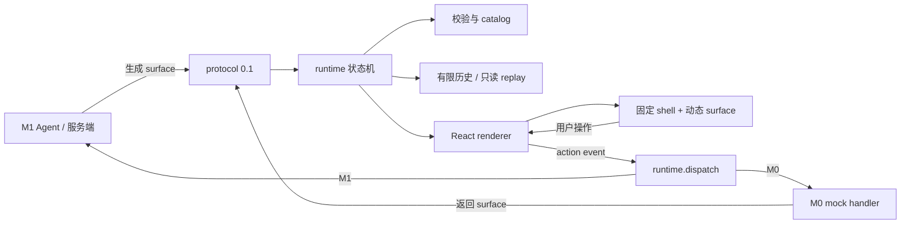

# 无相架构意图

## 分层



M0 只实现 `protocol`、`runtime`、`react` 和本地 playground；图中的 M0 mock handler 用于本地闭环，M1 Agent/服务端是未来真实模型方向，不能从图推断 M0 已接入模型。

## 组件职责

- **protocol**：定义版本、surface、revision、节点树、action allowlist 的类型和严格校验。它不渲染 UI，不执行副作用。
- **runtime**：保存当前 surface 和有限历史，处理原子更新、revision/event 新旧判断、错误和只读 replay。它不绑定 React 或具体模型供应商。
- **react**：将通过校验的节点映射到九类注册组件，负责用户输入转为 action event；不执行任意 surface 代码。
- **playground**：用 mock 数据串起表单、结果和回填，作为集成和回归样例，不是生产业务。

## 状态与不变量

1. 当前状态由一个合法的 `surfaceId + revision + tree` 表示；更新要么完整替换，要么保持原状态。
2. revision 必须按协议规则比较；过期更新和 event 不能改变当前状态。
3. 节点类型只来自已注册 catalog；action 只来自 allowlist，payload 先校验再交给调用方。
4. 历史容量有限；淘汰是可预期的，不以无限内存保存会话。
5. replay 是纯读取路径，不调用网络、模型、预订或其他副作用。
6. renderer 只消费通过 protocol/runtime 边界的数据；渲染器不绕过校验直接解释未知节点。

## 事件流

```text
surface 输入
  -> protocol 校验
  -> runtime 原子 replace
  -> React catalog 渲染
  -> 用户操作
  -> action allowlist + payload 校验
  -> event 返回调用方
```

M0 的调用方可在内存中处理 event；M1 才将 event 接到真实模型服务。事件协议、错误码和导出函数名必须以代码为准，文档不提前承诺未实现 API。

## 安全边界

边界由声明式节点、注册 catalog、action allowlist、严格输入校验和有限历史共同构成。M0 不执行模型或用户提供的 JavaScript，不允许通过 JSON 指定任意 React 组件；安全性质用测试和审计验证，不能宣称绝对安全。

## 生态边界

A2UI、MCP Apps、assistant-ui 只作为设计参照和后续评估对象。MCP Apps 的 HTML 沙箱 iframe、JSON-RPC/postMessage 通信与 M0 内部节点协议属于不同层次；兼容必须通过明确 adapter 和测试确认。M1 前以 ADR 记录 A2UI 映射/复用评估，避免把 `0.1` 误称为新标准。

## 演进方向

M1 在 runtime 边界之外接服务端模型生成、有限修复、取消/超时和文本 fallback；M2 先选一个生态 adapter，再增加流式更新。M3 再评估自托管 alpha、组织治理和商业边界。每次扩展都要保留 catalog、校验和副作用边界。
